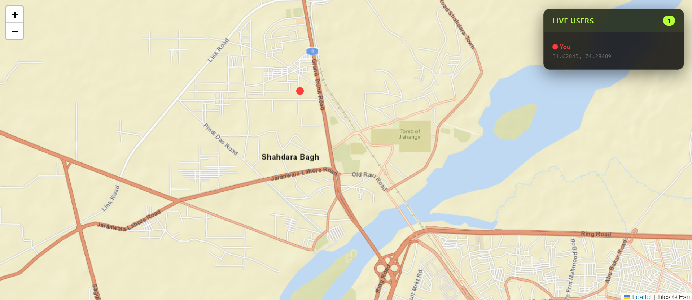

<div align="center">

# 📍 LivePin — Real-Time Location Tracker

**A real-time multi-user location tracking app built with Node.js, Express, and Socket.IO.** See every connected user live on an interactive map — with custom markers, live coordinates panel, and instant position updates.

[](https://nodejs.org)
[](https://socket.io)
[](https://leafletjs.com)
[](https://tailwindcss.com)

</div>

---

## 📸 Preview

> *Dark-themed map with red pulse markers — live user panel showing real-time coordinates*



---

## ✨ Features

- 📍 **Real-time tracking** — every connected user appears as a live marker on the map
- 🔴 **Custom markers** — pulsing red dot for yourself, bordered dot for other users
- 🗺️ **Interactive map** — powered by Leaflet.js with Esri street map tiles
- 📋 **Live users panel** — side panel showing all connected users and their coordinates
- 🔢 **User count badge** — live count of how many users are currently connected
- 📡 **Continuous updates** — uses `watchPosition()` for real-time position tracking as you move
- 🧹 **Auto cleanup** — disconnected users are instantly removed from the map and panel
- 🌑 **Dark UI** — sleek dark theme with red accent palette
- 📱 **Responsive** — full viewport map on all screen sizes

---

## 🗂️ Project Structure

```text
LivePin/
│
├── public/
│   ├── js/
│   │   └── script.js          # Client-side socket events, map logic & markers
│   └── style/
│       └── style.css          # Map, panel, markers & pulse animation
│
├── views/
│   └── index.ejs              # Main HTML shell
│
├── app.js                     # Express + Socket.IO server
├── package.json
├── package-lock.json
└── preview.png
```

---

## 🏁 Getting Started

```bash
# 1. Clone the repository
git clone https://github.com/Samiullah-2004/LivePin.git

# 2. Navigate into the project
cd LivePin

# 3. Install dependencies
npm install

# 4. Start the server
node app.js
```

Then open [http://localhost:3000](http://localhost:3000) in your browser.  
Open a second tab or device to see multi-user tracking in action.

> ⚠️ **Note:** Allow location access when prompted by the browser. For best results, test on a mobile device while moving.

---

## 🛠️ Tech Stack

| Technology | Purpose |
|---|---|
| **Express.js** | HTTP server & static file serving |
| **Socket.IO** | Real-time bidirectional communication |
| **Leaflet.js** | Interactive map rendering & markers |
| **EJS** | Server-side HTML templating |
| **Tailwind CSS** | Utility-first styling |
| **Geolocation API** | Browser-native location tracking |

---

## 🎮 How It Works

1. User opens the app and grants location permission
2. Browser's `watchPosition()` continuously monitors their GPS coordinates
3. Position updates are emitted to the server via Socket.IO
4. Server broadcasts the location to all connected clients
5. Every client updates that user's marker on the map in real time
6. When a user disconnects, their marker is instantly removed from all maps

---

## 👤 Author

**Samiullah Akram**  
Full Stack Developer from Lahore, Pakistan 🇵🇰

[](https://github.com/Samiullah-2004)
[](https://www.linkedin.com/in/samiullah-akram-a28461404/)
[](https://instagram.com/_s_a_m_i_u_l_l_a_h_)
[](mailto:samiullah.akram.3009@gmail.com)

---

## 📄 License

This project is open source and free to use for personal and educational purposes.  
If you use this as a reference or template, a credit would be appreciated! 🙏

---

<div align="center">

**Built with ❤️ by Samiullah — 2026**

</div>
